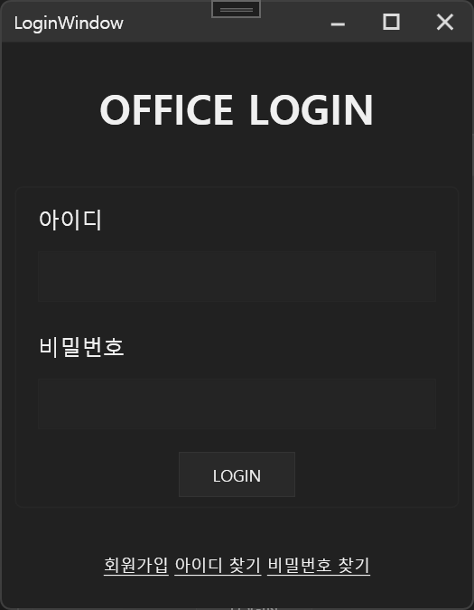
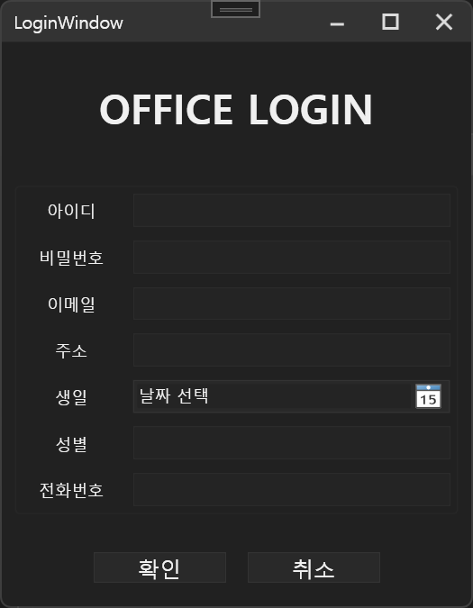
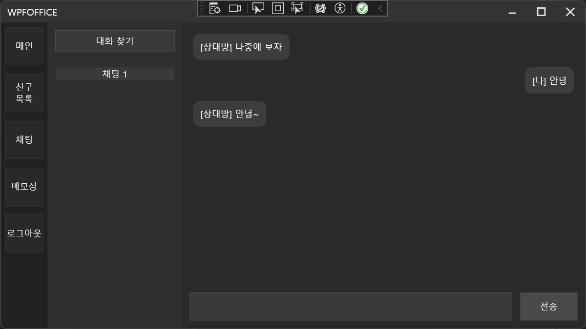
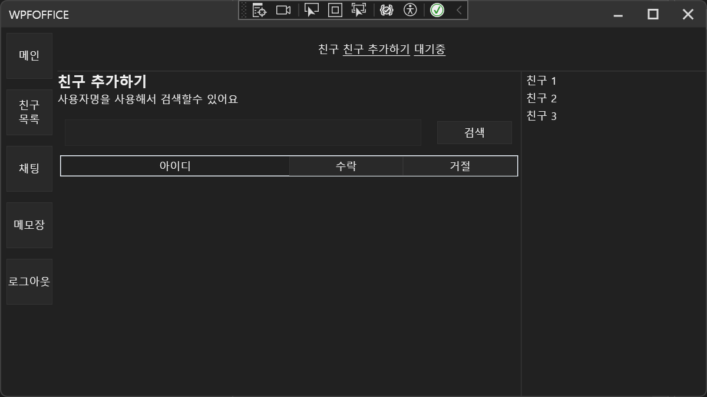
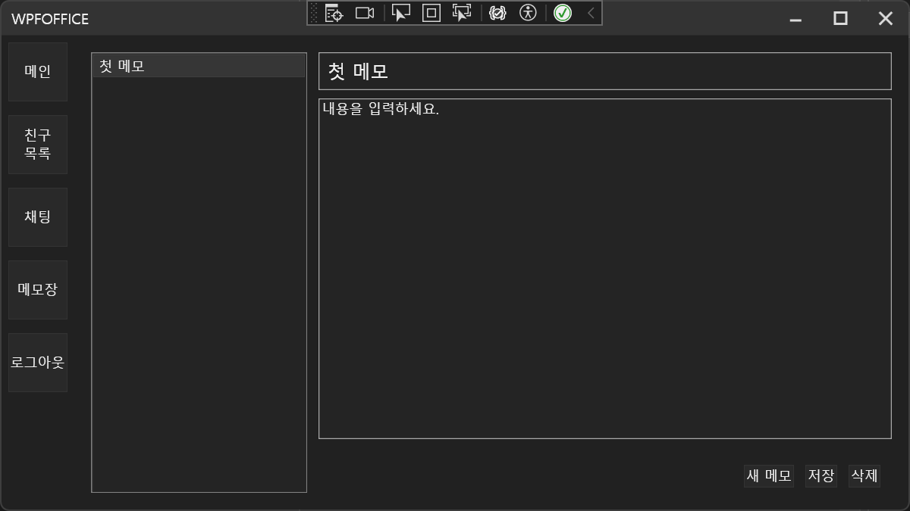

# OfficeProject

📌 **프로젝트 소개**  
OfficeProject는 C#과 WPF를 기반으로 한 데스크톱 커뮤니케이션 앱입니다. 
미국 현지 공장에서 외부 통신이 원활하지 않은 문제를 해결하고자 내부망 채팅 서버 아이디어에서 시작되었습니다.
로그인, 회원가입, 친구 관리, 메모장, 채팅 등 기본적인 커뮤니케이션 기능을 구현했습니다

WPF와 MVVM 패턴을 학습하고 실무 역량을 강화하기 위해 진행한 개인 프로젝트입니다.

---

## ✨ 주요 기능 (UI 중심)

| 기능 | 설명 |
|------|------|
| ✅ **로그인 / 회원가입** | 사용자 정보를 입력하고 인증하는 UI 구성 |
| ✅ **메인 페이지** | 로그인 후 진입하는 메인 화면 UI |
| ✅ **친구 관리** | 친구 추가 요청, 수락/거절, 친구 목록 확인 UI |
| ✅ **채팅 기능** | 기본 채팅 인터페이스 구성  |
| ✅ **메모장 기능** | 사용자 메모 입력을 위한 Notepad UI |

---

## 🧰 사용 기술

- **개발 언어**: C#  
- **UI 프레임워크**: WPF  
- **아키텍처**: MVVM   
- **버전 관리**: Git

---

## ⚠ 현재 상태

- ✅ UI 및 페이지 전환 정상 동작  
- ❌ 백엔드 미구현 (로컬 더미 데이터 기반 테스트)  
- ✅ MVVM 구조 일부 적용

---

## 🛠 향후 개선 방향

- 🔌 **백엔드 서버 연동 예정**  
  로그인, 회원정보, 친구 기능, 채팅 등을 DB 및 서버와 연결  
- 🎨 **UI 스타일 개선**  
  UX 개선 및 애니메이션 도입 등 시각적 완성도 향상

---

## ▶ 실행 방법

1. 저장소 클론
   ```bash
   git clone https://github.com/your-repository/OfficeProject.git

2. Visual Studio에서 OfficeProject.sln 열기

3. MainWindow.xaml을 시작 프로젝트로 설정하고 실행 (F5)

---

## 📚 프로젝트 목적
이 프로젝트는 단순히 기능을 구현하는 것을 넘어, WPF와 MVVM(Model-View-ViewModel)
아키텍처 패턴에 대한 깊이 있는 학습과 실무 역량 강화를 목표로 진행했습니다.
UI와 비즈니스 로직을 분리하여 코드의 유지보수성과 확장성을높이는 데 집중했으며,
사용자 인증부터 실시간 채팅, 친구 관리, 메모 등 커뮤니케이션 앱의 핵심 기능을 UI 중심으로 구현했습니다.

---

## 📷 Screenshots

| 로그인 | 회원가입 |
|--------|----------|
|  |  |

메인페이지


채팅



친구추가



메모장




